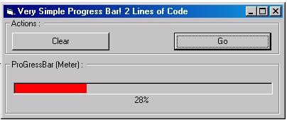



## Multy Color Progress Bar

### Description

Arent you tired of the old blue microsux colored progressBar? Then this is exacally what you need. in less then 2 lines of code and you will have a progressbar with any color you like. Enjoy it.

ps: ocx now included in the project file.
 
### More Info
 

             |
---                |---
**Submitted On**   |2002-11-05 18:15:02
**By**             |[Rafael Bonventi](https://github.com/Planet-Source-Code/PSCIndex/blob/master/ByAuthor/rafael-bonventi.md)
**Level**          |Beginner
**User Rating**    |3.7 (11 globes from 3 users)
**Compatibility**  |VB 5\.0, VB 6\.0
**Category**       |[Coding Standards](https://github.com/Planet-Source-Code/PSCIndex/blob/master/ByCategory/coding-standards__1-43.md)
**World**          |[Visual Basic](https://github.com/Planet-Source-Code/PSCIndex/blob/master/ByWorld/visual-basic.md)
**Archive File**   |[Multy\_Colo14962011122002\.zip](https://github.com/Planet-Source-Code/rafael-bonventi-multy-color-progress-bar__1-40652/archive/master.zip)

